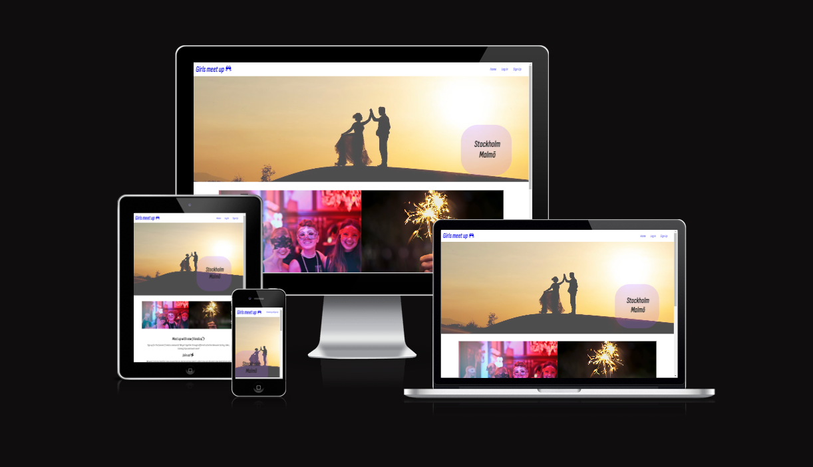
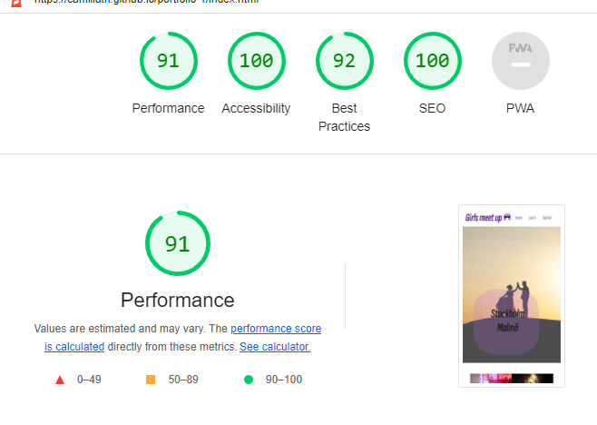

 <b>Devices</b>

<b>Girls meet out!</b>

Welcome to the funniest friends community! We started this community when covid and restriction limited us to live the life like before. We couldn't travel like before,
go to the gym, theater, cinema and so on.
We had to change our way to live. So we came up with the idea to create a group on Facebook, 
with some suggestions to meet covid-friendly
for old and new friends! There was great interest and we have tried to
hike in the mountains, horseback riding, cross-country skiing for example. 
Different activities we could do outside although covid.
When the restrictions lighted, we had the opportunities to go for a trip together. 
This has been a great opportunity to network with new friends and also 
support companies who had a hard time during covid.
Today we are 10 000 members och and our spots are filled fast when we arrange an event.

<b>Features</b>

login to the page and signup for the community and signup for newletter.

<b>The header</b>

a logo that take you back to homepage when clicked and a menu with home button, button to login page and button go signup page.

<b>main section</b>

an hero image 
info text about girls meetup

<b>The Sign Up Form</b>

form that signs up for girls meetup when you can choose city etc.

<b>Sign in section</b>

sign in to the community

<b>contact section</b>

links in the footer to social media channels

<b>Lighthouse score</b>

<b>Validator Testing</b>
no bugs at the validator tool for html and css  

<b>Deployment</b>
site is live at : https://camillath.github.io/portfolio-1/

<b>Credits</b>
the inspo for this site was taking from love running project
