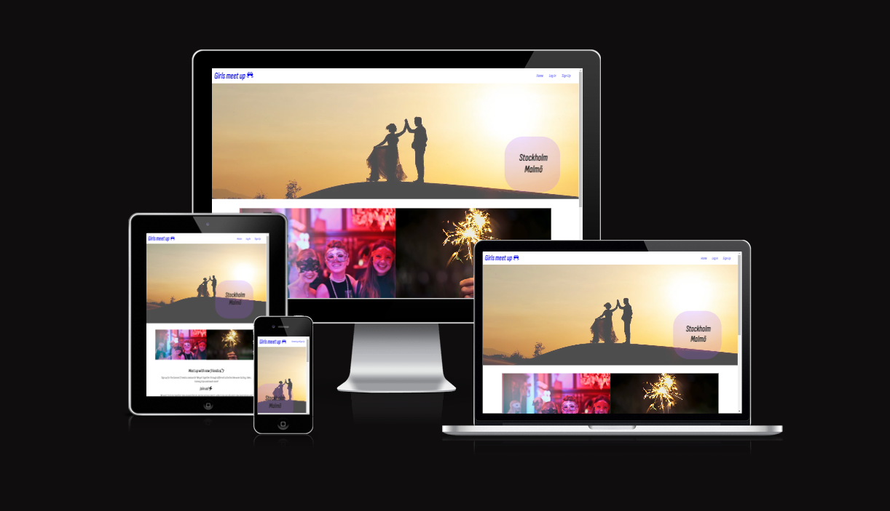
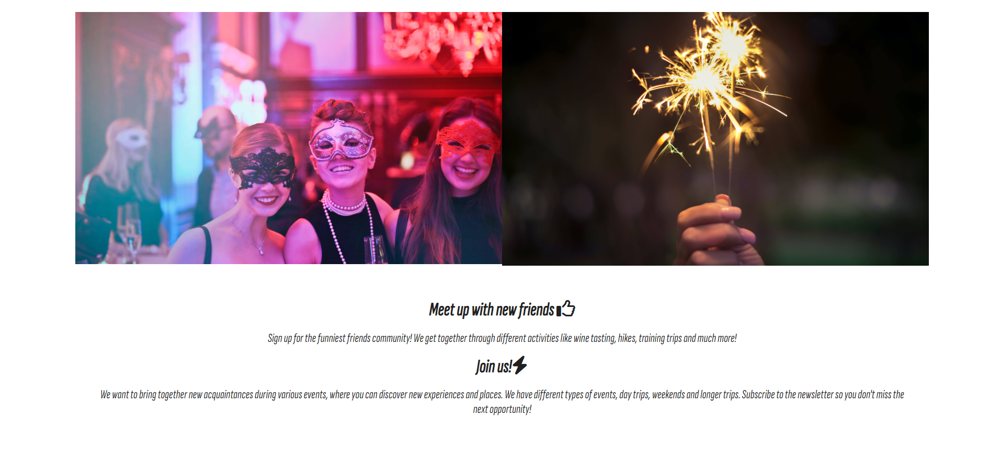
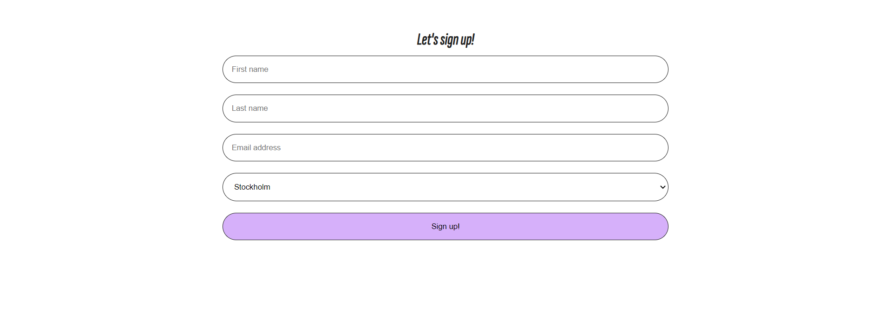
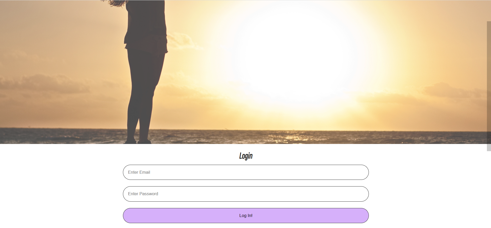
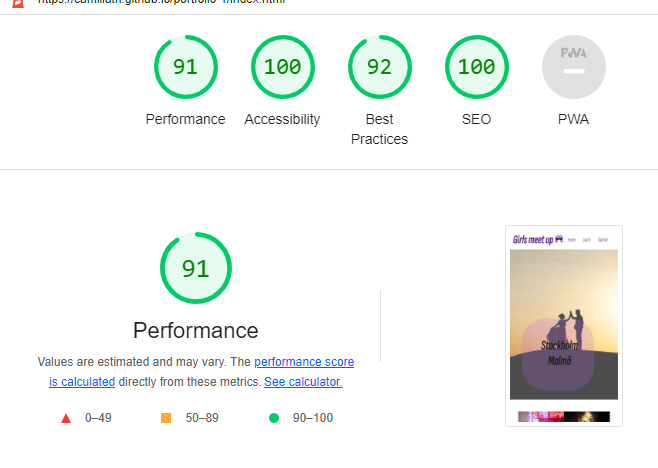

# Girls meet out

Welcome to the funniest friends community! We started this community when covid and restriction limited us to live the life like before. We couldn't travel like before,
go to the gym, theater, cinema and so on.
We had to change our way to live. So we came up with the idea to create a group on Facebook, 
with some suggestions to meet covid-friendly
for old and new friends! There was great interest and we have tried to
hike in the mountains, horseback riding, cross-country skiing for example. 
Different activities we could do outside although covid.
When the restrictions lighted, we had the opportunities to go for a trip together. 
This has been a great opportunity to network with new friends and also 
support companies who had a hard time during covid.
Today we are 10 000 members och and our spots are filled fast when we arrange an event.

## Features

login to the page and signup for the community and signup for newletter.

### Existing Features

__Header__

- A logo that take you back to homepage when clicked. A menu with "home" that navigates to homepage and "login" that navigates to login page and "sign up" that navigates to signup page. When hovering over each navlink an hover effect is applied. An "active" effect that shows and border what page the user are on.

__Hero section__

- An hero image with an overlaying image with information

__Main section__

- Images with info text about girls meetup with icons

__Sign up Form__

- Form that signs up for girls meetup when you can choose city etc. 
- Validation is applied so if not all input fields are filled with information the user get information what fields left to fill to proceed. And if the input is not an valid email the user get information about that.

__Sign in section__

- An form that let the user sign in to the community. 
- Validation is applied so if not the email field  are filled with email the user get information that input field needs to be filled and if the input is not an valid email the user get information about that. And if password is not filled the user get information about that.

__Footer section__

- links in the footer to social media channels and a newletter signup section where the user can fill email to get newletter. 
- Validation is applied so if not the email field  are filled with email the user get information that input field needs to be filled and if the input is not an valid email the user get information about that.

### Unimplemented Features

- Hero carousel that shows slidesshow of multiple images
- Google maps section thats shows on map where the events are located

## Testing

### Lighthouse score 

### Validator Testing

* HTML
   No errors were found when code was injected into the official [W3C validator](https://validator.w3.org/nu/?doc=https%3A%2F%2Fcode-institute-org.github.io%2Flove-running-2.0%2Findex.html)
* CSS
   No errors were found when code was injected into the official [(Jigsaw) validator](https://jigsaw.w3.org/css-validator/validator?uri=https%3A%2F%2Fvalidator.w3.org%2Fnu%2F%3Fdoc%3Dhttps%253A%252F%252Fcode-institute-org.github.io%252Flove-running-2.0%252Findex.html&profile=css3svg&usermedium=all&warning=1&vextwarning=&lang=en#css)

## Deployment

The site is deployed with github pages.

Steps to deploy: 
 * On the github repository go to the settings tab
 * Navigate to the source section drop down and select the master branch
 * When master branch i selected, the page will be refreshed automatically with details that indicates a successful deploy

site is live at : https://camillath.github.io/portfolio-1/

## Credits

the inspo for this site was taking from love running project
